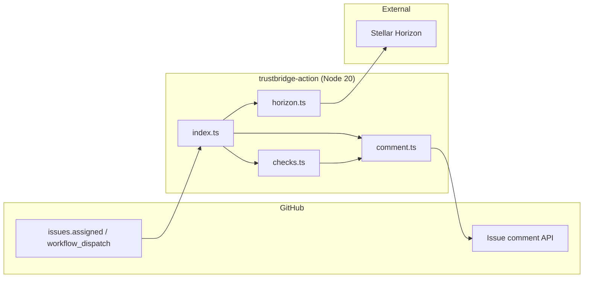
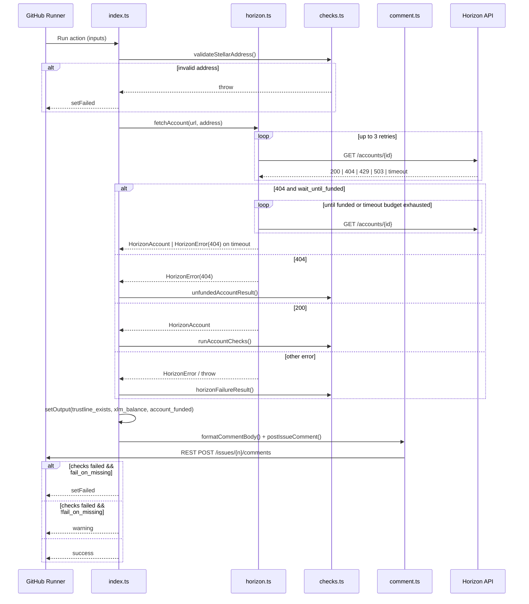

# Architecture

This document describes the internal design of **trustbridge-action**: how data flows from a GitHub event through Horizon to an issue comment and workflow outcome.

Related docs: [README](../README.md) · [Structure](STRUCTURE.md) · [Usage](USAGE.md) · [Error handling](ERROR_HANDLING.md)

---

## Goals and constraints

1. **Deterministic checks** — Given a Stellar address and asset configuration, produce a repeatable pass/fail result from Horizon state.
2. **Actionable feedback** — Every failure path should yield human-readable remediation in the issue comment.
3. **GitHub Actions idioms** — Use `@actions/core` for inputs/outputs/failure and `@actions/github` for REST API access.
4. **Resilience** — Transient Horizon errors (timeouts, 503, rate limits) are retried; permanent errors (404, invalid address) fail fast.
5. **Testability** — Pure validation logic lives in `checks.ts`, isolated from I/O for unit testing.

---

## High-level components



| Module | Responsibility |
|--------|----------------|
| `index.ts` | Read inputs, orchestrate fetch → validate → comment → fail/warn, set outputs |
| `horizon.ts` | HTTP client, response typing, retries, `HorizonError` |
| `checks.ts` | Address validation, trustline/XLM rules, result aggregation |
| `comment.ts` | Markdown rendering, Octokit `issues.createComment` |

---

## Execution sequence



---

## Data model

### HorizonAccount

Parsed from `GET /accounts/{account_id}`. The action primarily uses:

- `account_id` — canonical address
- `balances[]` — native XLM and credit assets
- `subentry_count` — available for future reserve calculations

### ValidationResult

Produced by `checks.ts`:

```typescript
interface ValidationResult {
  valid: boolean;
  accountFunded: boolean;
  trustlineExists: boolean;
  xlmBalance: string;
  xlmReserveMet: boolean;
  checks: CheckResultItem[];
  remediation?: string;
}
```

Each `CheckResultItem` maps to one ✅/❌ line in the issue comment.

---

## Check rules

### 1. Account funded

- **Pass:** Horizon returns HTTP 200 with account record.
- **Fail:** Horizon returns HTTP 404 (account not activated).

### 2. Asset trustline

- **Pass:** `balances` contains an entry where `asset_code` and `asset_issuer` match inputs (non-native).
- **Fail:** No matching entry. Message distinguishes **zero trustlines** vs **other trustlines present**.

### 3. XLM reserve

- **Pass:** Native balance ≥ `min_xlm_reserve` (default `1.5`).
- **Fail:** Balance below threshold; remediation includes delta to send.

Default `1.5` reflects Stellar protocol economics: **1 XLM** minimum account balance + **0.5 XLM** base reserve per trustline subentry.

---

## Horizon client design

`horizon.ts` implements:

| Feature | Implementation |
|---------|----------------|
| Timeout | `AbortController` per request (15s default) |
| Retries | Up to 3 on 429, 502, 503, 504, timeout |
| Backoff | Exponential (1s, 2s, 4s) or `Retry-After` header |
| 404 | Non-retryable `HorizonError` → unfunded path |
| URL normalization | Strips trailing slashes from `horizon_url` |

Errors are classified as **retryable** vs **terminal** to avoid masking real problems with infinite loops.

---

## GitHub integration

### Triggers (consumer workflow)

This action does not define its own trigger — the **consumer** workflow listens to:

- `issues` → `types: [assigned]` — primary automation path
- `workflow_dispatch` — manual runs with optional address input

### Permissions

Minimum for commenting:

```yaml
permissions:
  issues: write
  contents: read
```

### Comment context

`comment.ts` uses `github.context.payload.issue.number`. If the action runs outside an issue context (e.g. bare `workflow_dispatch` without issue payload), posting is skipped with a warning — checks and outputs still run.

---

## Build and runtime

| Aspect | Choice |
|--------|--------|
| Runtime | `node20` (see `action.yml`) |
| Language | TypeScript → CommonJS (`ES2020`) |
| Entry | `dist/index.js` (compiled from `src/index.ts`) |
| HTTP | `node-fetch` v2 (CommonJS-compatible) |

The action ships compiled JavaScript in `dist/`. Consumers reference a release tag; they do not run `npm install` in the action repo.

---

## Extension points

Future enhancements that fit the current architecture:

1. **Soroban / smart contract checks** — new module parallel to `horizon.ts`
2. **Multi-asset trustlines** — extend `CheckConfig` to accept a list
3. **PR comments** — extend `comment.ts` to detect `context.payload.pull_request`
4. **Sponsor-aware reserve math** — use `num_sponsoring` / `num_sponsored` from Horizon

See [CONTRIBUTING.md](../CONTRIBUTING.md) for proposing changes.

---

## Security considerations

- **No secrets in logs** — addresses are public; tokens are never logged.
- **`github_token` scope** — use least privilege (`issues: write` only where needed).
- **Horizon URL** — consumers on testnet should pass testnet Horizon explicitly; do not rely on address format alone.
- **Input validation** — G-address regex prevents malformed Horizon paths and log injection in comments.

---

[← Back to README](../README.md)
